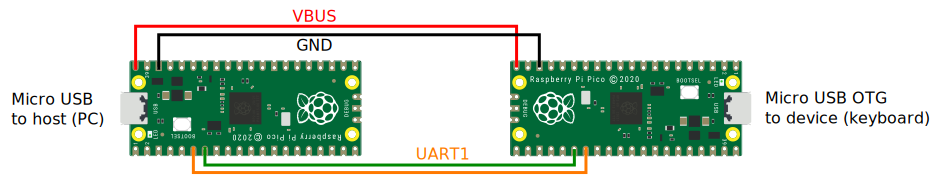

# USB to USB HID Protocol Converter

Makes USB keyboards appear as basic boot protocol HID devices to the host

## Wiring Diagram



## Setup

At the time of writing, pico SDK included outdated TinyUSB, so it was merged with master branch.

```bash
cd $PICO_SDK_PATH/lib/tinyusb
git pull
git merge origin/master
```

Building the project.
```bash
mkdir build
cd build
cmake ..
make
```

Images can be flashed with OpenOCD.
```bash
cd build
sudo openocd -f interface/cmsis-dap.cfg -c "adapter speed 5000" -f target/rp2040.cfg -c "program device.elf reset exit"
sudo openocd -f interface/cmsis-dap.cfg -c "adapter speed 5000" -f target/rp2040.cfg -c "program host.elf reset exit"
```

Device firmware acts as a USB HID device, host firmware understands USB HID. Pico connected to PC needs to have device FW.